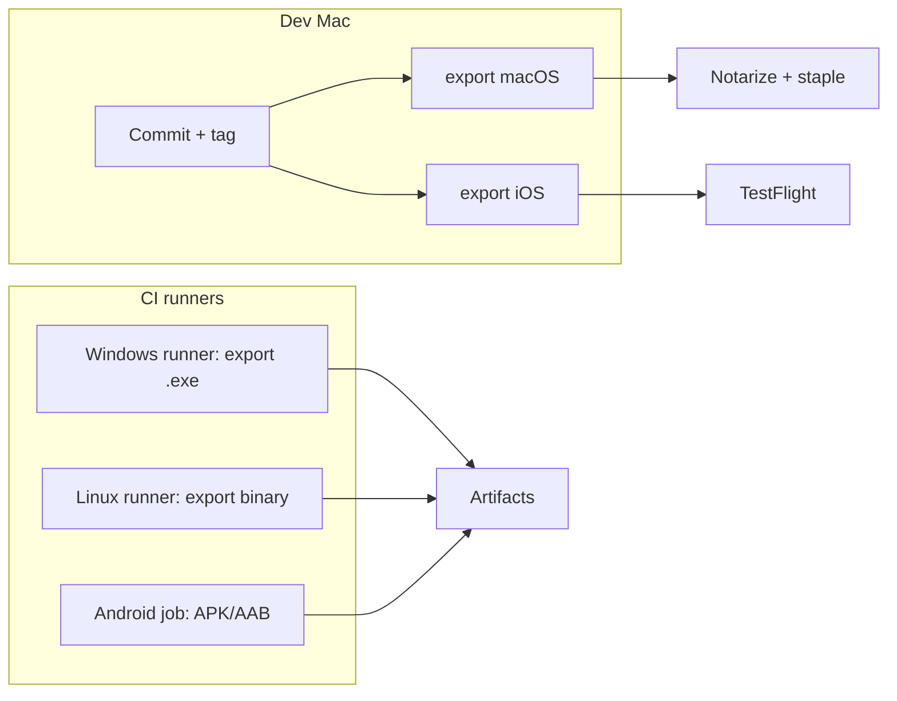

# Exporting Ultravibe (all platforms)

Godot **4.7 mono** project. Presets live in `export_presets.cfg` at the project root.

**Workspace toolkit** (shared across Gnosis games, CI templates when ready):  
[`../../templates/godot-export/README.md`](../../templates/godot-export/README.md)

| Preset | Platform | Output |
|--------|----------|--------|
| `Windows Desktop` | Windows x86_64 | `builds/windows/Ultravibe.exe` |
| `macOS` | macOS universal | `builds/macos/Ultravibe.zip` |
| `Linux` | Linux x86_64 | `builds/linux/Ultravibe.x86_64` |
| `Android` | Android arm64 | `builds/android/Ultravibe.apk` |
| `iOS` | iOS arm64 | `builds/ios/Ultravibe.ipa` |

Bundle / package id: **`com.gnosisgames.ultravibe`**

---

## 1. One-time setup (every machine)

### Export templates

In Godot: **Editor → Manage Export Templates → Download and Install** (must match **4.7 mono** — same build as `scripts/resolve_godot.sh`).

Or download from [godotengine.org](https://godotengine.org/download) and point the editor at the `.tpz` file.

### Open the project

```bash
cd ultravibe
source ../scripts/resolve_godot.sh
"$GODOT" --path .
```

**Project → Export** should list all five presets. Open each once so Godot can merge any missing 4.7 option keys.

---

## 2. Desktop (Windows, macOS, Linux)

### From the editor

1. **Project → Export** → pick preset → **Export Project**.
2. macOS: set **Signing** (Developer ID) and **Notarization** for distribution outside the App Store.
3. Windows: optional Authenticode signing under preset options.

### From CLI

```bash
cd ultravibe
chmod +x tools/export_build.sh tools/export_all_local.sh

# One platform
./tools/export_build.sh macOS
./tools/export_build.sh "Windows Desktop" release

# Batch: everything this machine can export (macOS + Linux + mobile if configured)
./tools/export_all_local.sh
```

From workspace root (any game):

```bash
cd 02_godot
./scripts/export_godot.sh ultravibe macOS
./scripts/export_godot_all_local.sh ultravibe
```

### Host requirements

| Target | Build on |
|--------|----------|
| macOS `.app` / `.zip` | macOS (codesign / notarize) |
| Windows `.exe` | Windows (or cross-compile with extra tooling) |
| Linux binary | Linux or macOS with Linux templates |

---

## 3. Android

### Prerequisites

- [Android SDK](https://developer.android.com/studio) + platform tools
- [JDK 17](https://adoptium.net/) (Godot 4.7 Gradle)
- In Godot: **Editor → Editor Settings → Export → Android** → set SDK, JDK, debug keystore paths

### First export

```bash
./tools/export_build.sh Android
```

This runs `--install-android-build-template` once, then exports the APK.

### Release signing

1. Generate a upload keystore (keep offline):
   ```bash
   keytool -genkey -v -keystore ultravibe-release.keystore -alias ultravibe -keyalg RSA -keysize 2048 -validity 10000
   ```
2. In **Project → Export → Android → Keystore**, set release keystore path + passwords.
3. Credentials are stored in `.godot/export_credentials.cfg` (gitignored) — do not commit.

### Play Store

- Bump `version/code` and `version/name` in the Android preset before each upload.
- Consider an **AAB** export (`gradle_build/export_format`) for Google Play — switch in preset options after smoke-testing APK.

---

## 4. iOS

### Prerequisites (macOS only)

- Xcode + command line tools
- Apple Developer account
- Provisioning profiles (development + App Store / Ad Hoc)

### Required preset fields

In **Project → Export → iOS**:

| Field | Value |
|-------|--------|
| App Store Team ID | 10-char id from developer.apple.com |
| Bundle Identifier | `com.gnosisgames.ultravibe` |
| Provisioning profiles | Debug + Release |

Or set via environment variables at export time ([Godot iOS docs](https://docs.godotengine.org/en/stable/tutorials/export/exporting_for_ios.html)):

```bash
export GODOT_IOS_PROVISIONING_PROFILE_UUID_DEBUG="..."
export GODOT_IOS_PROVISIONING_PROFILE_UUID_RELEASE="..."
./tools/export_build.sh iOS
```

### Orientation

Landscape-only (matches 1920×1080 desktop layout). Configured in preset + `project.godot` `display/window/handheld/orientation`.

---

## 5. What gets excluded from builds

All presets use:

```text
exclude_filter="tests/*, screenshots/*, docs/*, scratch/*, play_hud_*.png"
```

Adjust in `export_presets.cfg` if you need parity docs or tools in shipped builds.

---

## 6. CI / smoke check

Packaging readiness (no templates required):

```bash
"$GODOT" --path . --headless --script res://tests/test_project_packaging_smoke.gd
```

After templates are installed, smoke-export one desktop target:

```bash
./tools/export_build.sh Linux release
# run builds/linux/Ultravibe.x86_64 on a Linux machine
```

---

## 7. Multi-platform release workflow (suggested)



1. Tag release in `ultravibe/` (and engine if needed).
2. Build desktop on native OS runners.
3. Android/iOS through signed pipelines with secrets in CI env (keystore, provisioning UUIDs).
4. Attach builds to GitHub Release or store consoles.

---

## 8. Troubleshooting

| Error | Fix |
|-------|-----|
| No export templates | Install 4.7 **mono** templates |
| Android SDK not found | Editor Settings → Export → Android paths |
| iOS Team ID error | Set 10-character team id, not display name |
| macOS “damaged” gatekeeper | Codesign + notarize, or `xattr -cr` for local dev only |
| Linux binary won’t run | `chmod +x`; install Vulkan/Mesa drivers |

---

## Files

| Path | Purpose |
|------|---------|
| `export_presets.cfg` | Preset definitions (commit) |
| `.godot/export_credentials.cfg` | Passwords / signing secrets (never commit) |
| `builds/` | Local export output (gitignored) |
| `tools/export_build.sh` | CLI helper |
